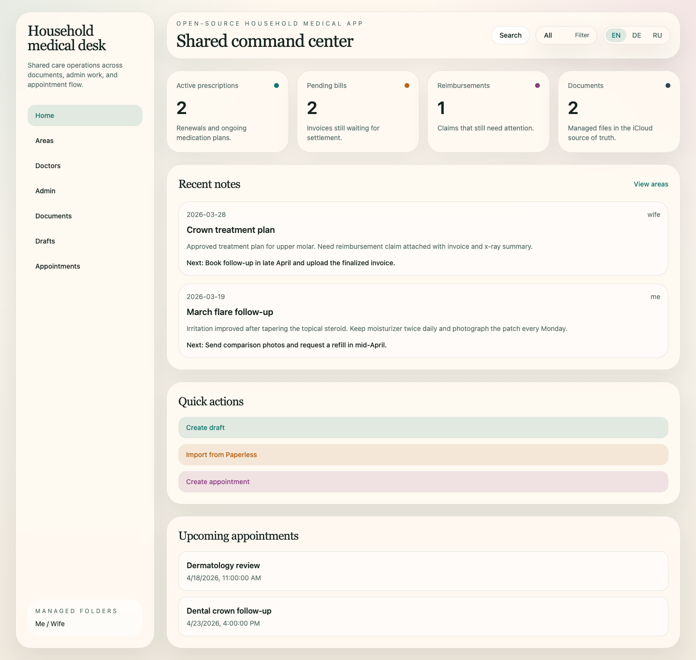
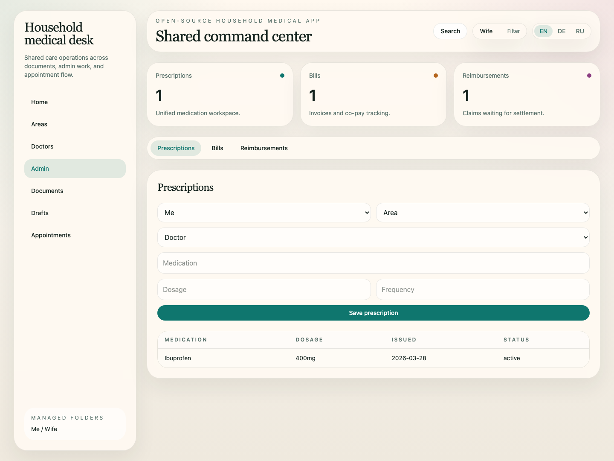
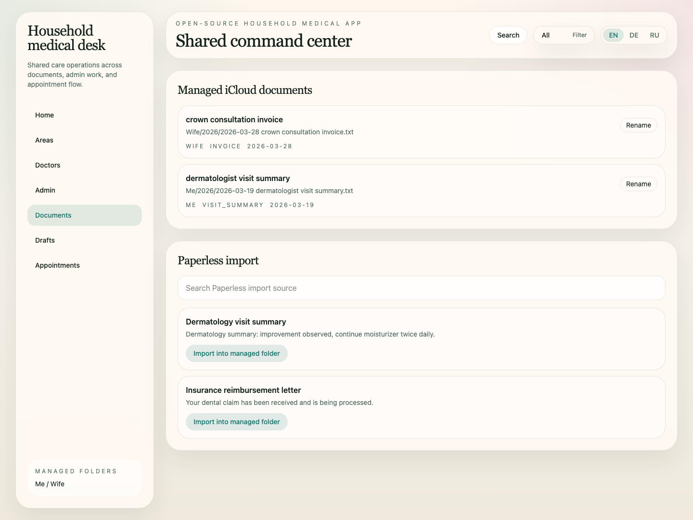

# Open Household Medical App

An open-source, macOS-first household medical organizer built with Bun,
React, Hono, SQLite, and a local MCP server.
Developed with 🤖 Codex/ChatGPT 5.4.

Repository: [github.com/ilyannn/medical-app](https://github.com/ilyannn/medical-app)

## Screenshots

### Home dashboard



### Unified admin workspace



### Documents and Paperless import



## What it includes

- Shared household dashboard with `All`, `Me`, and `Wife` filters
- Areas, doctors, notes, prescriptions, bills, reimbursements, drafts, documents, and appointments
- iCloud-backed document management with managed person folders only
- Paperless import picker backed by fake fixtures by default
- Local-first MCP server over stdio
- Fake macOS bridge for CI and a Swift bridge package for local native work
- `Justfile`-driven developer workflow

## Simple start

```bash
just start
```

## Developers

```bash
just install
just setup-hooks
just check
just dev
```

The demo config stores data in `./var/medical-app.sqlite` and uses `./demo/icloud-root` as the managed document root.

Contributor workflow, public-safe repo rules, and review expectations live
in [CONTRIBUTING.md](CONTRIBUTING.md).

Pre-push security check

- `just scan-secrets` validates tracked files for common secret patterns.
- `just setup-hooks` configures a local pre-push hook so `git push` runs
  `scan-secrets` automatically.
- Use `git push --no-verify` only when explicitly needed to bypass the
  local pre-push check.

Biome is the default TypeScript linter and formatter for this repo.
`just lint` runs Biome checks, TypeScript typechecking, SyntaQLite against
the repo's SQLite DDL and tagged SQL statements, and Markdown linting.
If `syntaqlite` is not already installed, the repo bootstraps a local
Python 3.12 toolchain with `uv` under `.uv-python` and `.venv-sql`.

## Commands

- `just dev`: run the API and frontend
- `just install`: install dependencies and create `.env` from `.env.example` when missing
- `just start`: run the simple local startup flow via `just install` and `just dev`
- `just format`: run Biome formatting across the repo
- `just lint`: run Biome linting, TypeScript typechecking, SyntaQLite SQL
  linting, and Markdown linting
- `just screenshots-readme`: regenerate the README screenshots from seeded demo data
- `just test`: run unit, integration, and Playwright E2E tests
- `just check`: run `just lint` and `just test`
- `just test-live`: optional local live-integration coverage
- `just test-native`: compile and verify the native Swift bridge locally

## Architecture

- `src/server`: Hono API, Drizzle-backed persistence, domain services, adapters
- `src/web`: React frontend with React Router, TanStack Query, Headless UI, Tailwind
- `src/mcp`: first-party MCP server
- `native/macos-bridge`: Swift package for Contacts and EventKit access
